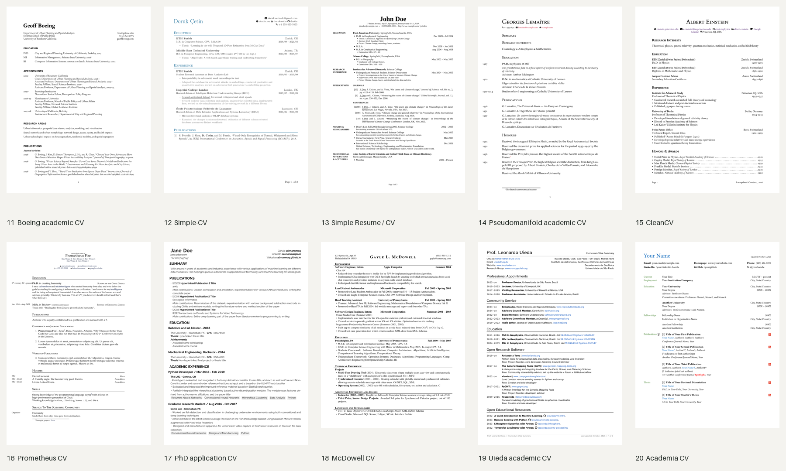

# Ten additional minimal academic LaTeX CV templates

Templates **11–20** supplement the existing ten house themes in `../themes/`.
These are actual upstream template sources, pinned to commits with their licenses retained.
The previews show the upstream authors' **sample content**, not Ali's CV data.

[Open the visual gallery](index.html) · [Build results](build-results.json)



| # | Template / source | Style | License | PDF |
|---|---|---|---|---|
| 11 | [Boeing academic CV](https://github.com/gboeing/cv) | Traditional single-column academic CV; understated rules and comprehensive scholarly sections. | MIT | [Preview](previews/11-boeing.pdf) |
| 12 | [Simple-CV](https://github.com/dcetin/Simple-CV) | Minimal sectioned CV with BibLaTeX publications and modular content files. | MIT | [Preview](previews/12-simplecv.pdf) |
| 13 | [Simple Resume / CV](https://github.com/zachscrivena/simple-resume-cv) | Monochrome academic CV with a narrow date column and bundled fonts. | Unlicense | [Preview](previews/13-simple-resume.pdf) |
| 14 | [Pseudomanifold academic CV](https://github.com/Pseudomanifold/latex-cv) | Restrained typography and an academic publication list. | MIT | [Preview](previews/14-pseudomanifold.pdf) |
| 15 | [CleanCV](https://github.com/giladturok/CleanCV) | Modular, minimal academic CV with bibliography support and clear section hierarchy. | MIT | [Preview](previews/15-cleancv.pdf) |
| 16 | [Prometheus CV](https://github.com/chrisby/prometheusCV) | Research-focused modular layout with separate education, service and publications files. | MIT | [Preview](previews/16-prometheus.pdf) |
| 17 | [PhD application CV](https://github.com/salmanmaq/academic-cv-template) | Compact graduate-application layout with academic sections and a dedicated class. | MIT | [Preview](previews/17-phd-application.pdf) |
| 18 | [McDowell CV](https://github.com/dnl-blkv/mcdowell-cv) | Black-and-white serif layout; a compact option for an academic/industry crossover CV. | MIT | [Preview](previews/18-mcdowell.pdf) |
| 19 | [Uieda academic CV](https://github.com/leouieda/cv) | Long-form academic CV with a clean single-column structure and strong scholarly hierarchy. | BSD-3-Clause | [Preview](previews/19-uieda.pdf) |
| 20 | [Academia CV](https://github.com/zhuokaizhao/academia_cv_template) | Academic section structure with restrained color and compact dated entries. | MIT | [Preview](previews/20-academia.pdf) |

## Build all previews

Run from the repository root:

```bash
python3 resume/scripts/academic_template_library.py --verify
python3 resume/scripts/academic_template_library.py --build
```

Requires a full TeX Live installation (pdfLaTeX, XeLaTeX, LuaLaTeX, latexmk, biber),
Poppler (`pdfinfo`, `pdftoppm`), and Pillow (`pip install Pillow`) for the overview image.
The gallery uses free fonts available with TeX Live.
See `build-results.json` for the exact build command and page count for each preview.
Use `--only 11-boeing` to build one design.

## Edit a template

Copy its `upstream/<id>/` directory into your working area and edit the catalog's entrypoint.
Keep the license and attribution with any derivative. The vendored originals stay immutable
so the hash check can distinguish local adaptations from upstream code.
`catalog.json` records source URL, exact commit, license, compiler, and SHA-256 hashes.
The original house themes and `resume/data/cv.yaml` remain the working CV system.

## Portable build adjustments

`compatibility.json` records small, reproducible changes applied only to build copies.
Font substitutions affect preview typography; upstream source files remain byte-for-byte intact.
The ready-to-edit portable sources are left in `.build/academic-templates/<id>/source/` after a build.

- **14-pseudomanifold:** Use free TeX Gyre fonts instead of requiring Adobe Minion Pro, Cabin and Fira Mono; separate the sample's adjacent education entries.
- **16-prometheus:** Compile fontspec with XeLaTeX and substitute the free TeX Gyre Pagella family for separately installed Cormorant fonts.
- **17-phd-application:** Restore the Raleway font switch and provide a minimal monochrome variant: plain headings, hidden link borders, neutral skill tags, and a spaced name.
- **18-mcdowell:** Use LuaLaTeX for microtype letterspacing and the free TeX Gyre Termes equivalent of Times New Roman.
